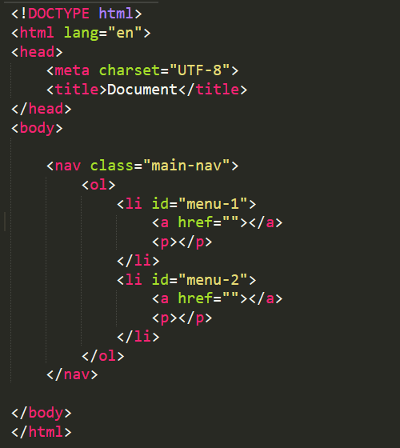
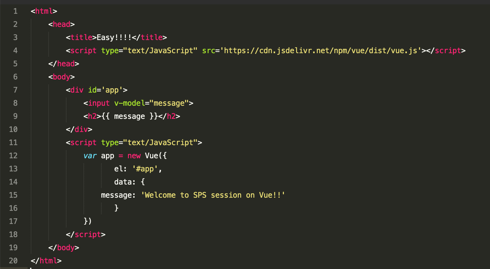
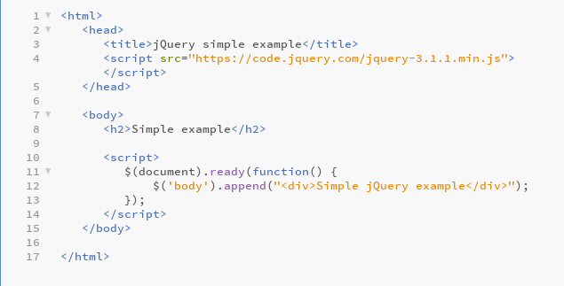
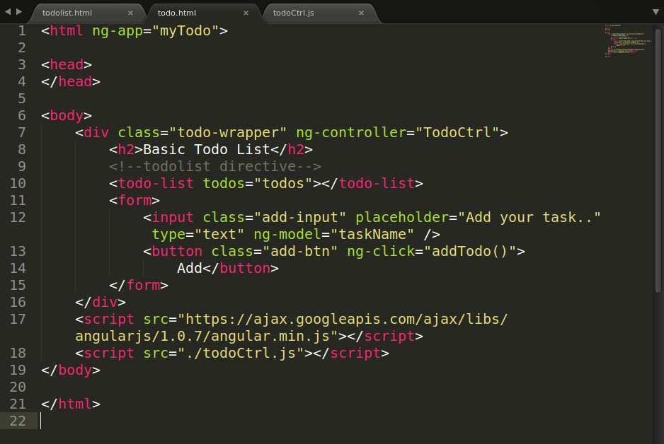
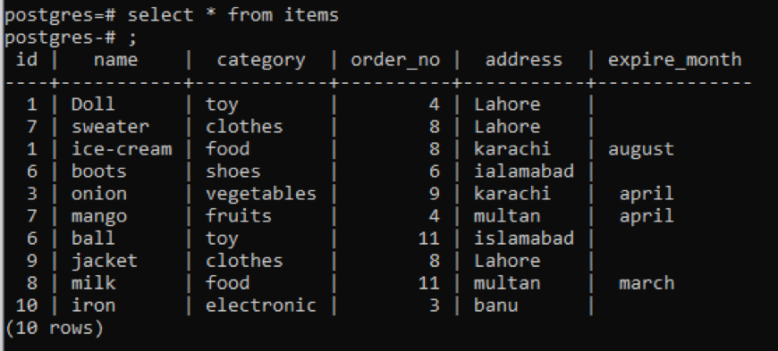

# Développement d'application Web avec le framework Ruby On Rails
## I. Programmation côté client
### 1. HTML
* HTML : Hyper Text Markup Language
* HTML est un produit des travaux du W3C. 
* HTML est un langage de description permettant de structurer et d’afficher différents objets (textes, tableaux, images, vidéos, …).
* HTML définit la structure logique d’un document web
* HTML est composé d’un ensemble de commandes de formatage
* HTML utilise des délimiteurs appelés balises ou tags.
* Un éditeur de texte (bloc-notes) et un navigateur web (Internet Explorer) suffisent pour mettre en œuvre du HTML
**  **
[Pour apprendre plus.](https://www.w3schools.com/html/default.asp)
### 2. CSS
* Les CSS (Cascading Style Sheet = feuille de styles) sont des documents au format texte, tout comme le HTML, mais prévue ni pour être visualisée par l'internaute ni pour être affichée directement dans le navigateur. 
* Une feuille de styles définit comment une page HTML doit être affichée.
* En utilisant des styles, il est par exemple possible de dire que tous les liens, au lieu d'être bleus ou violets comme d'habitude, doivent être blanc; ou bien que le texte est toujours jaune.
* Avec les CSS, le navigateur pourra parcourir le document HTML et, lorsqu'il rencontre une balise, il demande à la CSS de quelle manière il doit l'afficher. 
** [Pour apprendre plus.](https://www.w3schools.com/css/default.asp) **
* De nos jours il est de coutume d'utiliser les framework pour facilité et accélérer le travail. Dans la suite du cours, nous présentons le framework CSS Bootstrap.  
####  Bootstrap
Une initiative de Twitter, Bootstrap est le framework CSS le plus populaire. Il présente un nombre important de modules et d’extensions. La documentation disponible est tout aussi impressionnante. Il fonctionne sur un système de grille en douze colonnes avec un affichage adapté pour différentes tailles d’écran et il est possible de personnaliser les fichiers CSS. Bootstrap offre de nombreux composants d’interface utilisateur, nécessaires au développement de sites Web : Navigation, formulaires, cartes, fenêtres modales, boutons, barres de progression, alertes de notification.
**  **
[Pour apprendre plus.](https://www.w3schools.com/bootstrap/bootstrap_ver.asp)
[Pour apprendre plus.](https://getbootstrap.com/)
### 3. JavaScript
* Créé à l’origine par Netscape, JavaScript a été conçu pour traiter localement des évènements provoqués par le client : Déplacement du pointeur de souris ou click de souris, soumission d’un formulaire.
* Javascript est un langage interprété : le code du script est analysé et exécuté au fur et à mesure par l’interpréteur (partie intégrante du navigateur). JavaScript permet d'éffectuer des traitements sans recourir au serveur.
* Dans la suite du cours, nous présentons quelques framework JavaScript.
#### 3.1 Vue.js
Vue.js (aussi appelé plus simplement Vue), est un framework JavaScript open-source utilisé pour construire des interfaces utilisateur et des applications web monopages. Il s'appuie sur les standards HTML, CSS et JavaScript et fournit un modèle de programmation déclaratif et basé sur des composants qui vous aide à développer efficacement des interfaces utilisateur, qu'elles soient simples ou complexes. Selon votre cas d'utilisation, Vue peut être utilisé de différentes manières :

* Améliorer le HTML statique sans étape de construction
* Intégration en tant que composants Web sur n'importe quelle page
* Application monopage (SPA)
* Fullstack / Rendu côté serveur (SSR)
* Jamstack / Génération de sites statiques (SSG)
* Ciblant les ordinateurs de bureau, les mobiles, WebGL et même le terminal
**  **
[Pour apprendre plus.](https://vuejs.org/guide/introduction.html)
#### 3.2 jQuery
jQuery est une librairie ou bibliothèque JavaScript. jQuery consiste en un ensemble de blocs de codes JavaScripts préconçus et qui vont être généralement enfermés dans des méthodes. Il va donc nous suffire d’appeler ces méthodes pour exécuter le code qu’elles contiennent.
**  **
[Pour apprendre plus.](https://www.pierre-giraud.com/jquery-apprendre-cours/introduction/)
#### 3.3 AngularJS
AngularJS est un framework de développement frontal open source populaire principalement utilisé pour développer des applications Web dynamiques. AngularJS transfère tout le contenu du serveur vers le navigateur et charge toutes les pages Web simultanément. Une fois le contenu chargé, cliquer sur n'importe quel lien de la page ne recharge pas tout le contenu de la page ; au lieu de cela, il met simplement à jour les sections de la page.
**  **
[Pour apprendre plus.](https://docs.angularjs.org/tutorial)
## II. Programmation côté serveur
### 1. Ruby
Ruby est un langage de programmation open source relativement simple, flexible et facile d'accès, notamment pour les débutants. Il est dit interprété, orienté objet et multiparadigme et se voit de plus en plus utilisé. Il présente en effet une vision différente du développement, selon le principe : tout est objet. Ce langage est doté d’un Framework d’application Web : Ruby On Rails.
** [Pour apprendre plus.](https://ruby-doc.org/core-3.1.2/)
### 2. Ruby On Rails
Ruby on Rails, également appelé RoR ou Rails, est un framework web libre écrit en Ruby. Il suit le motif de conception modèle-vue-contrôleur (MVC). Il propose une structure qui permet de développer rapidement et intuitivement. Cependant, il impose un grand niveau d'abstraction dans la programmation qui apporte en contrepartie l'économie d'écrire soi-même la plupart des routines obligatoires d'une application web.
** [Pour apprendre plus.](https://guides.rubyonrails.org/) **
RoR supporte plusieurs systèmes de base de données dont :  SQLite, MySQL, MariaDB, PostgreSQL, Oracle, Microsoft SQL Server et MongoDB.
### 3. Base de Données Rélationnelle
* PostgreSQL
PostgreSQL est un puissant système de base de données relationnelle objet open source qui utilise et étend le langage SQL combiné à de nombreuses fonctionnalités qui stockent et mettent à l'échelle en toute sécurité les charges de travail de données les plus complexes.
**  **
[Pour apprendre plus.](https://www.w3schools.com/bootstrap/bootstrap_ver.asp)
## III. Déploiement
### 1. AWS EC2
Amazon Elastic Compute Cloud ou EC2 est un service proposé par Amazon permettant à des tiers de louer des serveurs sur lesquels exécuter leurs propres applications web. EC2 permet un déploiement extensible des applications en fournissant une interface web par laquelle un client peut créer des machines virtuelles, c'est-à-dire des instances du serveur, sur lesquelles le client peut charger n'importe quel logiciel de son choix. Un client peut créer, lancer, et arrêter des instances de serveurs en fonction de ses besoins, et paye en fonction du temps d'usage des serveurs, d'où le terme d'« Élastique » (Elastic en anglais).
** [Pour apprendre plus.](https://docs.aws.amazon.com/ec2/index.html?nc2=h_ql_doc_ec2)
### 2. Heroku
Heroku est une plate-forme qui permet le déploiement d'applications web. Heroku supporte les bases de données relationnelles et NoSQL. Il possède une architecture modulaire qui permet de supporter plusieurs environnements d'exécution grâce à la virtualisation logicielle par des containers nommés dynos. Heroku prend en charge plusieurs langages de programmation tels que : Ruby, Java, Node.js, Scala, Clojure, Python, PHP et Go.
** [Pour apprendre plus.](https://devcenter.heroku.com/articles/getting-started-with-ruby)